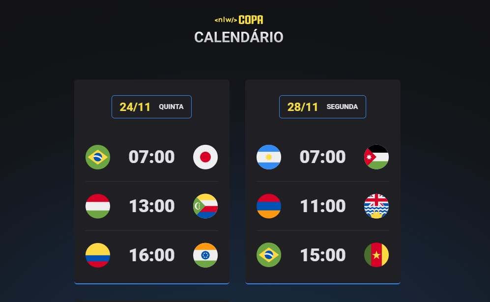

<h1 align="center"> NLW Copa 2022 </h1>

Evento exclusivo e gratuito, promovido pela Rocketseat para ensino de tecnologias WEB.

  <a href="#-tecnologias">Tecnologias</a>&nbsp;&nbsp;&nbsp;|&nbsp;&nbsp;&nbsp;
  <a href="#-projeto">Projeto</a>&nbsp;&nbsp;&nbsp;|&nbsp;&nbsp;&nbsp;
  <a href="#-layout">Layout</a>&nbsp;&nbsp;&nbsp;|&nbsp;&nbsp;&nbsp;
  <a href="#memo-licença">Licença</a>

  

 

  

## 🚀 Tecnologias

Esse projeto foi desenvolvido com as seguintes tecnologias:

- HTML e CSS
- JavaScript
- Git e Github

## 💻 Projeto

O Calendário da Copa é um projeto que mostra os jogos da Copa de 2022.

## 🔖 Layout

Você pode visualizar o layout do projeto através [DESSE LINK](https://www.figma.com/community/file/1169028052212317700). É necessário ter conta no [Figma](https://figma.com) para acessá-lo.

## :memo: Licença

Esse projeto está sob a licença MIT.

---

Feito com ♥ by Rocketseat :wave: [Participe da nossa comunidade!](https://discord.gg/rocketseat)
Fonte de informações para os jogos: [Google](https://www.google.com/search?q=google+calendar+copa&sxsrf=ALiCzsbWsanxmlhUgAXVWvg9FN3JZxm1wQ%3A1667416604672&ei=HMJiY_LKKO2b1sQPmcS66AU&ved=0ahUKEwjyyKfzmpD7AhXtjZUCHRmiDl0Q4dUDCA8&uact=5&oq=google+calendar+copa&gs_lcp=Cgxnd3Mtd2l6LXNlcnAQAzIFCAAQgAQyBQgAEIAEMggIABCABBDLATIICAAQgAQQywEyCAgAEIAEEMsBMggIABCABBDLATIICAAQgAQQywEyCAgAEIAEEMsBMggIABCABBDLATIICAAQgAQQywE6CggAEEcQ1gQQsAM6BwgAELADEEM6CwgAEIAEELEDEIMBSgQIQRgASgQIRhgAUOADWKQIYNEJaAFwAXgAgAHEAYgB8wWSAQMwLjSYAQCgAQHIAQrAAQE&sclient=gws-wiz-serp#sie=lg;/m/0fp_8fm;2;/m/030q7;mt;fp;1;;;)